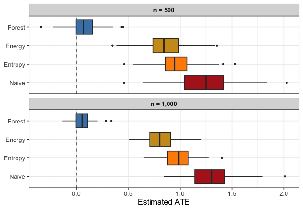

# Getting Started with forestBalance

## Overview

`forestBalance` estimates average treatment effects (ATE) in
observational studies by combining multivariate random forests with
kernel energy balancing. The key idea is:

1.  Fit a random forest that jointly predicts treatment *and* outcome
    from covariates, so that the tree structure captures confounding.
2.  Use the forest’s leaf co-membership to define a similarity kernel.
3.  Obtain balancing weights via a closed-form kernel energy distance
    solution.

Because the kernel reflects the nonlinear relationships between
covariates, treatment, and outcome, the resulting weights can balance
complex confounding structure that linear methods may miss.

The method is described in:

> De, S. and Huling, J.D. (2025). *Data adaptive covariate balancing for
> causal effect estimation for high dimensional data.* arXiv:2512.18069.

## Setup

``` r
library(forestBalance)
library(WeightIt)
```

## Simulating data

[`simulate_data()`](http://jaredhuling.org/forestBalance/reference/simulate_data.md)
generates observational data with nonlinear confounding. The propensity
score depends on $`X_1`$ through a Beta density, and the outcome depends
nonlinearly on $`X_1`$, $`X_2`$, and $`X_5`$:

``` r
set.seed(123)
dat <- simulate_data(n = 800, p = 10, ate = 0)

# True ATE
dat$ate
#> [1] 0
# Naive (unadjusted) estimate
round(mean(dat$Y[dat$A == 1]) - mean(dat$Y[dat$A == 0]), 4)
#> [1] 0.9812
```

The naive difference-in-means is badly biased because of confounding.

## Estimating the ATE

### Forest balance

``` r
fit_fb <- forest_balance(dat$X, dat$A, dat$Y, num.trees = 1000)
fit_fb
#> Forest Kernel Energy Balancing
#> -------------------------------------------------- 
#>   n = 800  (n_treated = 275, n_control = 525)
#>   Trees: 1000
#>   Solver: direct
#>   ATE estimate: 0.0388
#>   ESS: treated = 191/275 (70%)   control = 394/525 (75%)
#> -------------------------------------------------- 
#> Use summary() for covariate balance details.
```

### Entropy balancing (WeightIt)

Entropy balancing finds weights that exactly balance covariate means
between treated and control groups:

``` r
df <- data.frame(A = dat$A, dat$X)
fit_ebal <- weightit(A ~ ., data = df, method = "ebal")

ate_ebal <- weighted.mean(dat$Y[dat$A == 1], fit_ebal$weights[dat$A == 1]) -
            weighted.mean(dat$Y[dat$A == 0], fit_ebal$weights[dat$A == 0])
```

### Energy balancing (WeightIt)

Energy balancing minimizes the energy distance between the weighted
treated and control covariate distributions:

``` r
fit_energy <- weightit(A ~ ., data = df, method = "energy")

ate_energy <- weighted.mean(dat$Y[dat$A == 1], fit_energy$weights[dat$A == 1]) -
              weighted.mean(dat$Y[dat$A == 0], fit_energy$weights[dat$A == 0])
```

### Comparison

| Method            |    ATE |
|:------------------|-------:|
| Naive             | 0.9812 |
| Entropy balancing | 0.8246 |
| Energy balancing  | 0.6277 |
| Forest balance    | 0.0388 |
| Truth             | 0.0000 |

Single-replication ATE estimates.

## Covariate balance

[`summary()`](https://rdrr.io/r/base/summary.html) shows the full
balance comparison. Let’s also check balance on nonlinear
transformations of the covariates, since the confounding operates
through the Beta density:

``` r
X <- dat$X
X.nl <- cbind(
  X[, 1]^2, X[, 2]^2, X[, 5]^2,
  X[, 1] * X[, 2], X[, 1] * X[, 5],
  dbeta(X[, 1], 2, 4), dbeta(X[, 5], 2, 4)
)
colnames(X.nl) <- c("X1^2", "X2^2", "X5^2", "X1*X2", "X1*X5",
                     "Beta(X1)", "Beta(X5)")

summary(fit_fb, X.trans = X.nl)
#> Forest Kernel Energy Balancing
#> ============================================================ 
#>   n = 800  (n_treated = 275, n_control = 525)
#>   Trees: 1000
#>   Kernel density: 29.0% nonzero
#> 
#>   ATE estimate: 0.0388
#> ============================================================ 
#> 
#> Covariate Balance (|SMD|)
#> ------------------------------------------------------------ 
#>   Covariate     Unweighted      Weighted
#>   ----------  ------------  ------------
#>   X1              0.1668 *        0.0220
#>   X2              0.2956 *        0.0086
#>   X3                0.0277        0.0148
#>   X4              0.1102 *        0.0242
#>   X5                0.0430        0.0210
#>   X6                0.0189        0.0055
#>   X7                0.0945        0.0258
#>   X8                0.0733        0.0033
#>   X9                0.0332        0.0284
#>   X10               0.0734        0.0055
#>   ----------  ------------  ------------
#>   Max |SMD|         0.2956        0.0284
#>   (* indicates |SMD| > 0.10)
#> 
#> Transformed Covariate Balance (|SMD|)
#> ------------------------------------------------------------ 
#>   Transform     Unweighted      Weighted
#>   ----------  ------------  ------------
#>   X1^2            0.2904 *        0.0259
#>   X2^2              0.0941        0.0322
#>   X5^2              0.0841        0.0694
#>   X1*X2           0.1303 *        0.0144
#>   X1*X5             0.0573        0.0582
#>   Beta(X1)        0.6847 *        0.0347
#>   Beta(X5)          0.0289        0.0138
#>   ----------  ------------  ------------
#>   Max |SMD|         0.6847        0.0694
#> 
#> Effective Sample Size
#> ------------------------------------------------------------ 
#>   Treated: 191 / 275  (70%)
#>   Control: 394 / 525  (75%)
#> 
#> Energy Distance
#> ------------------------------------------------------------ 
#>   Unweighted: 0.0486
#>   Weighted:   0.0144
#> ============================================================
```

We can use
[`compute_balance()`](http://jaredhuling.org/forestBalance/reference/compute_balance.md)
to compare all methods on the same terms:

``` r
bal_fb     <- compute_balance(dat$X, dat$A, fit_fb$weights, X.trans = X.nl)
bal_ebal   <- compute_balance(dat$X, dat$A, fit_ebal$weights, X.trans = X.nl)
bal_energy <- compute_balance(dat$X, dat$A, fit_energy$weights, X.trans = X.nl)
bal_unwtd  <- compute_balance(dat$X, dat$A, rep(1, dat$n), X.trans = X.nl)
```

| Method | Max SMD (linear) | Max SMD (nonlinear) | ESS treated | ESS control |
|:---|---:|---:|:---|:---|
| Unweighted | 0.2956 | 0.6847 | 100% | 100% |
| Entropy balancing | 0.0000 | 0.6213 | 93% | 98% |
| Energy balancing | 0.0074 | 0.4879 | 84% | 87% |
| Forest balance | 0.0284 | 0.0694 | 70% | 75% |

Balance diagnostics across methods.

All three weighting methods reduce the linear covariate imbalance. Both
energy balancing the forest balance approach also reduce imbalance on
*nonlinear* functions of the covariates, as they both aim to balance the
joint distributions of covariates, however, forest balancing
over-emphasizes full distributional balance of confounders specifically
rather than all possible covariates.

## Simulation study

A simulation study with 100 replications at two sample sizes
($`n = 500`$ and $`n = 1{,}000`$) demonstrates how the methods compare
and how performance changes with $`n`$:

``` r
run_sim <- function(n, nreps = 50, num.trees = 500, seed = 1) {
  set.seed(seed)
  methods <- c("Naive", "Entropy", "Energy", "Forest")
  results <- matrix(NA, nreps, length(methods), dimnames = list(NULL, methods))

  for (r in seq_len(nreps)) {
    dat <- simulate_data(n = n, p = 10, ate = 0)
    df  <- data.frame(A = dat$A, dat$X)

    fit_fb <- forest_balance(dat$X, dat$A, dat$Y, num.trees = num.trees)

    w_ebal   <- tryCatch(weightit(A ~ ., data = df, method = "ebal")$weights,
                          error = function(e) rep(1, dat$n))
    w_energy <- tryCatch(weightit(A ~ ., data = df, method = "energy")$weights,
                          error = function(e) rep(1, dat$n))

    results[r, "Naive"]   <- mean(dat$Y[dat$A == 1]) - mean(dat$Y[dat$A == 0])
    results[r, "Entropy"] <- weighted.mean(dat$Y[dat$A == 1], w_ebal[dat$A == 1]) -
                              weighted.mean(dat$Y[dat$A == 0], w_ebal[dat$A == 0])
    results[r, "Energy"]  <- weighted.mean(dat$Y[dat$A == 1], w_energy[dat$A == 1]) -
                              weighted.mean(dat$Y[dat$A == 0], w_energy[dat$A == 0])
    results[r, "Forest"]  <- fit_fb$ate
  }
  results
}

res_500  <- run_sim(n = 500,  seed = 1)
res_1000 <- run_sim(n = 1000, seed = 1)
```

|    n | Method  |   Bias |     SD |   RMSE |
|-----:|:--------|-------:|-------:|-------:|
|  500 | Naive   | 1.1672 | 0.2460 | 1.1928 |
|  500 | Entropy | 0.9590 | 0.1898 | 0.9776 |
|  500 | Energy  | 0.8407 | 0.2029 | 0.8649 |
|  500 | Forest  | 0.0983 | 0.1493 | 0.1787 |
| 1000 | Naive   | 1.2292 | 0.1975 | 1.2449 |
| 1000 | Entropy | 0.9674 | 0.1314 | 0.9762 |
| 1000 | Energy  | 0.7815 | 0.1254 | 0.7915 |
| 1000 | Forest  | 0.0882 | 0.0897 | 0.1258 |

Simulation results (50 reps, true ATE = 0).



All weighting methods improve over the naive estimator. At $`n = 500`$,
entropy balancing (which only targets linear covariate means) retains
substantial bias, while energy balancing and forest balance both reduce
bias more effectively. At $`n = 1{,}000`$, all methods improve, but
forest balance continues to show the lowest bias and competitive RMSE,
reflecting the advantage of its confounding-targeted kernel.

## Step-by-step interface

For more control, the pipeline can be run in stages:

``` r
library(grf)

dat <- simulate_data(n = 500, p = 10)

# 1. Fit the joint forest
forest <- multi_regression_forest(dat$X, scale(cbind(dat$A, dat$Y)),
                                  num.trees = 500)

# 2. Extract leaf node matrix (n x B)
leaf_mat <- get_leaf_node_matrix(forest, dat$X)
dim(leaf_mat)
#> [1] 500 500

# 3. Build sparse proximity kernel
K <- leaf_node_kernel(leaf_mat)
round(100 * length(K@x) / prod(dim(K)), 1)  # % nonzero
#> [1] 31.2

# 4. Compute balancing weights
bal <- kernel_balance(dat$A, K)

# 5. Estimate ATE
weighted.mean(dat$Y[dat$A == 1], bal$weights[dat$A == 1]) -
  weighted.mean(dat$Y[dat$A == 0], bal$weights[dat$A == 0])
#> [1] 0.3063087
```
