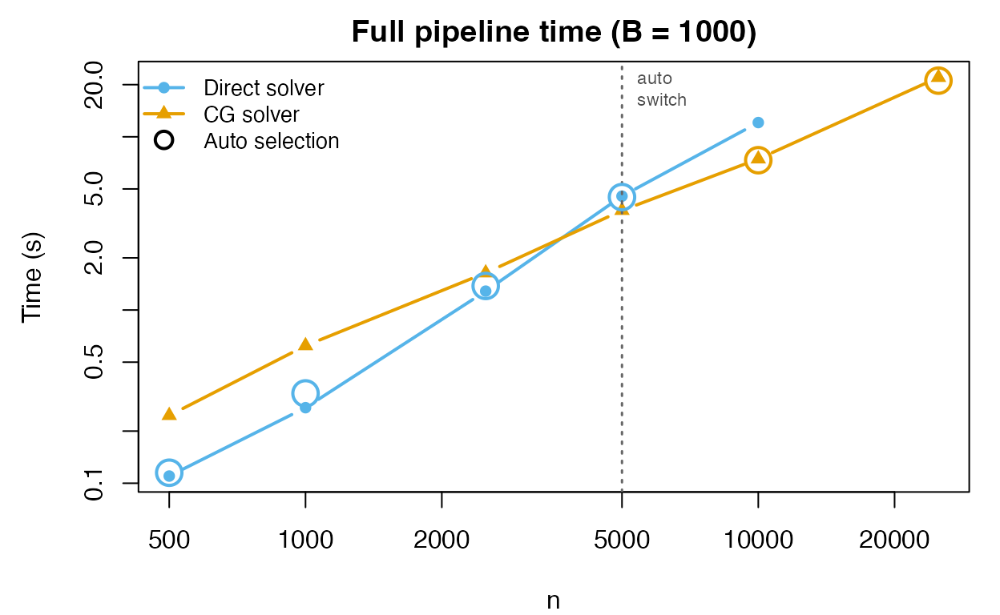
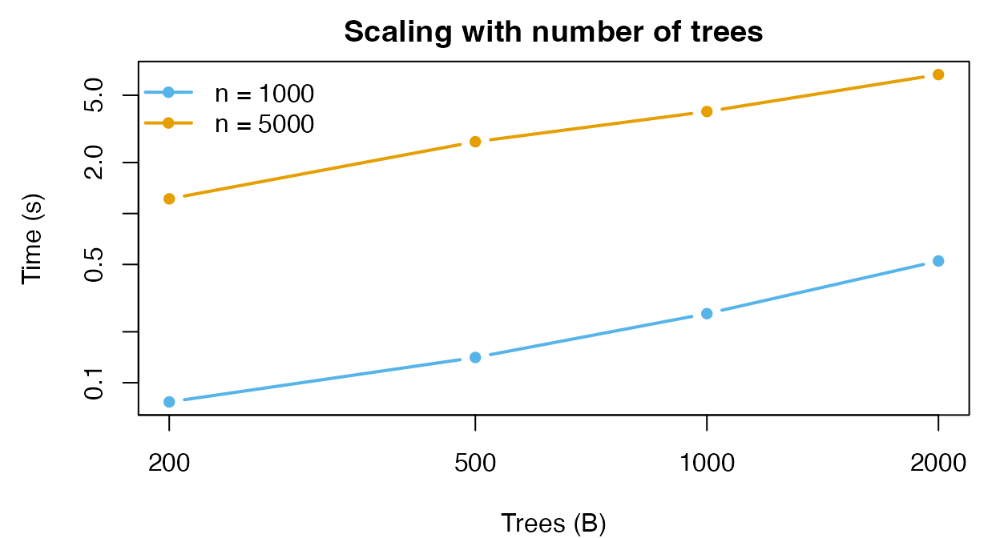
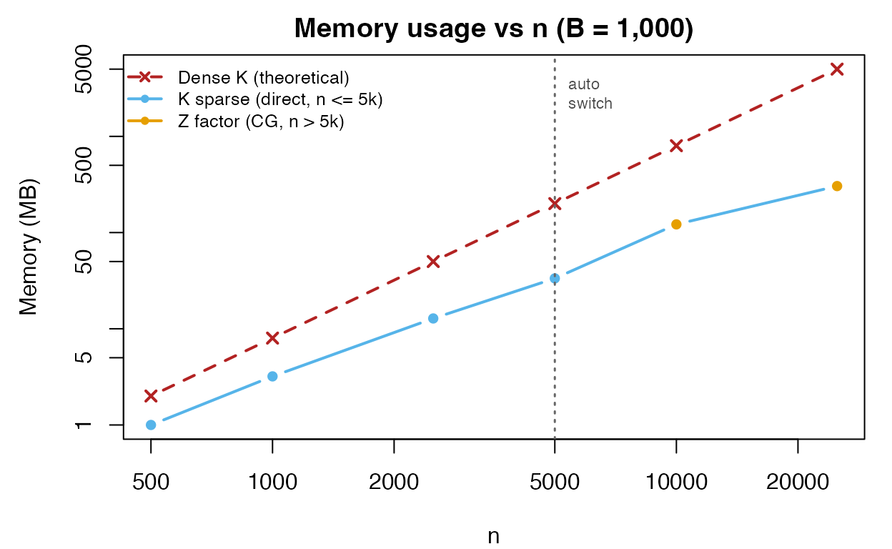

# Performance and Scalability

## Overview

This vignette benchmarks the `forestBalance` pipeline to characterize
how speed and memory scale with sample size ($`n`$) and number of trees
($`B`$).

`forestBalance` adaptively selects between two linear solvers:

- **Direct** ($`n \le 5{,}000`$): sparse Cholesky on the treated and
  control sub-blocks of the kernel matrix. Exact solution.
- **Conjugate gradient (CG)** ($`n > 5{,}000`$): iterative solver using
  the factored $`Z`$ representation ($`K = Z Z^\top / B`$), so the full
  kernel matrix is never formed. This saves both time and memory at
  large $`n`$.

``` r
library(forestBalance)
library(grf)
library(Matrix)
```

## Mathematical background

### The kernel energy balancing system

Given a kernel matrix $`K \in \mathbb{R}^{n \times n}`$ and a binary
treatment vector $`A \in \{0,1\}^n`$ with $`n_1`$ treated and $`n_0`$
control units, the kernel energy balancing weights $`w`$ are obtained by
solving the linear system
``` math
K_q \, w = z,
```
where $`K_q`$ is the *modified kernel* and $`z`$ is a right-hand side
vector determined by a linear constraint.

The modified kernel is defined element-wise as
``` math
K_q(i,j)
  = \frac{A_i \, A_j \, K(i,j)}{n_1^2}
  + \frac{(1-A_i)(1-A_j) \, K(i,j)}{n_0^2}.
```

A critical structural observation is that $`K_q(i,j) = 0`$ whenever
$`A_i \neq A_j`$: the treated–control cross-blocks are identically zero.
Therefore $`K_q`$ is **block-diagonal**:
``` math
K_q = \begin{pmatrix} K_{tt} / n_1^2 & 0 \\ 0 & K_{cc} / n_0^2 \end{pmatrix},
```
where $`K_{tt} = K[A{=}1,\; A{=}1]`$ is the $`n_1 \times n_1`$ treated
sub-block and $`K_{cc} = K[A{=}0,\; A{=}0]`$ is the $`n_0 \times n_0`$
control sub-block.

The right-hand side vector $`b`$ has a similarly separable structure.
Writing $`\mathbf{r} = K \mathbf{1}`$ (the row sums of $`K`$), we have
``` math
b_i = \frac{A_i \, r_i}{n_1 \, n} + \frac{(1-A_i) \, r_i}{n_0 \, n}.
```

The full system decomposes into two **independent** sub-problems:

- **Treated block:** solve $`K_{tt} \, w_t = n_1^2 \, z_t`$ of size
  $`n_1`$,
- **Control block:** solve $`K_{cc} \, w_c = n_0^2 \, z_c`$ of size
  $`n_0`$,

where $`z_t`$ and $`z_c`$ are the constraint-adjusted right-hand sides
for each group (each requiring two preliminary solves to determine the
Lagrange multiplier).

### The kernel factorization

The proximity kernel is $`K = Z Z^\top / B`$, where $`Z`$ is a sparse
$`n \times L`$ indicator matrix ($`L = \sum_{b=1}^B L_b`$, total leaves
across all trees). Each row of $`Z`$ has exactly $`B`$ nonzero entries
(one per tree), so $`Z`$ has $`nB`$ nonzeros total.

### Direct solver (block Cholesky)

For moderate $`n`$, we form the sub-block kernels explicitly:
``` math
K_{tt} = Z_t Z_t^\top / B, \qquad K_{cc} = Z_c Z_c^\top / B,
```
where $`Z_t = Z[A{=}1, \,\cdot\,]`$ and $`Z_c = Z[A{=}0, \,\cdot\,]`$.
Each sub-block is computed via a sparse `tcrossprod`. The linear systems
are then solved by sparse Cholesky factorization.

**Computational Cost:** $`O(nB \cdot \bar{s})`$ for the two sub-block
cross-products (where $`\bar{s}`$ is the average leaf size), plus
$`O(n_1^{3/2} + n_0^{3/2})`$ for sparse Cholesky (in the best case).

### CG solver (matrix-free)

For large $`n`$, forming $`K_{tt}`$ and $`K_{cc}`$ becomes expensive.
The conjugate gradient (CG) solver avoids forming *any* kernel matrix by
operating on the factored representation. To solve
``` math
K_{tt} \, x = r \quad \Longleftrightarrow \quad Z_t Z_t^\top x = B \, r,
```
CG only needs matrix–vector products of the form
``` math
v \;\mapsto\; Z_t \bigl(Z_t^\top v\bigr),
```
each costing $`O(n_1 B)`$ via two sparse matrix–vector multiplies. The
same applies to the control block with $`Z_c`$.

Here, the memory use is $`O(nB)`$ for $`Z`$ alone, versus $`O(n^2)`$ for
the kernel. At $`n = 25{,}000`$ with $`B = 1{,}000`$ this is ~300 MB vs
~4.7 GB. Each CG iteration costs $`O(n_g B)`$ (where $`n_g`$ is the
group size). Convergence typically requires 100–200 iterations,
independent of $`n`$, so the total cost is
$`O(n_g B \cdot T_{\text{iter}})`$. The six required solves (three per
block) are independent and each converges in a similar number of
iterations.

**Computational Cost:**
$`O\bigl((n_1 + n_0) \cdot B \cdot T_{\text{iter}}\bigr)`$ where
$`T_{\text{iter}} \approx 100\text{--}200`$. This scales linearly in
both $`n`$ and $`B`$, making it the preferred solver for large problems.

## End-to-end timing

We benchmark the full
[`forest_balance()`](http://jaredhuling.org/forestBalance/reference/forest_balance.md)
pipeline (forest fitting, leaf extraction, kernel/Z construction, and
weight computation) across a range of sample sizes with $`B = 1{,}000`$
trees. To show the effect of solver choice, we run each $`n`$ with both
`solver = "direct"` and `solver = "cg"` where feasible:

``` r
n_vals <- c(500, 1000, 2500, 5000, 10000, 25000)
B <- 1000
p <- 10

bench <- do.call(rbind, lapply(n_vals, function(nn) {
  set.seed(123)
  dat <- simulate_data(n = nn, p = p)

  # Auto (default)
  t_auto <- system.time(
    fit_auto <- forest_balance(dat$X, dat$A, dat$Y, num.trees = B)
  )["elapsed"]

  # Direct (skip for n > 10000 — too slow)
  if (nn <= 10000) {
    t_dir <- system.time(
      fit_dir <- forest_balance(dat$X, dat$A, dat$Y, num.trees = B,
                                solver = "direct")
    )["elapsed"]
  } else {
    t_dir <- NA
  }

  # CG (run for all n)
  t_cg <- system.time(
    fit_cg <- forest_balance(dat$X, dat$A, dat$Y, num.trees = B,
                             solver = "cg")
  )["elapsed"]

  data.frame(n = nn, trees = B,
             auto = t_auto, direct = t_dir, cg = t_cg,
             auto_solver = fit_auto$solver)
}))
```

|     n | Trees | Direct (s) | CG (s) | Auto picks |
|------:|------:|-----------:|:-------|:-----------|
|   500 |  1000 |       0.11 | 0.25   | direct     |
|  1000 |  1000 |       0.27 | 0.62   | direct     |
|  2500 |  1000 |       1.29 | 1.64   | direct     |
|  5000 |  1000 |       4.54 | 3.76   | direct     |
| 10000 |  1000 |      12.08 | 7.45   | cg         |
| 25000 |  1000 |          – | 22.01  | cg         |

Full pipeline time by solver.



The dashed vertical line marks $`n = 5{,}000`$, where `solver = "auto"`
switches from direct to CG. The circled points show the auto-selected
solver at each $`n`$. For $`n \le 5{,}000`$ the direct solver is faster;
for $`n > 5{,}000`$ the CG solver wins and the gap widens with $`n`$.

## Scaling with number of trees

``` r
tree_vals <- c(200, 500, 1000, 2000)
n_test <- c(1000, 5000)

tree_bench <- do.call(rbind, lapply(n_test, function(nn) {
  do.call(rbind, lapply(tree_vals, function(B) {
    set.seed(123)
    dat <- simulate_data(n = nn, p = 10)
    t <- system.time(
      fit <- forest_balance(dat$X, dat$A, dat$Y, num.trees = B)
    )["elapsed"]
    data.frame(n = nn, trees = B, time = t)
  }))
}))
```

|    n | Trees | Time (s) |
|-----:|------:|---------:|
| 1000 |   200 |     0.08 |
| 1000 |   500 |     0.14 |
| 1000 |  1000 |     0.26 |
| 1000 |  2000 |     0.52 |
| 5000 |   200 |     1.22 |
| 5000 |   500 |     2.66 |
| 5000 |  1000 |     4.01 |
| 5000 |  2000 |     6.62 |

Pipeline time across tree counts.



The pipeline scales approximately linearly in both $`n`$ and $`B`$.

## Kernel sparsity and memory

When the direct solver is used ($`n \le 5{,}000`$), the kernel is formed
as a sparse matrix. The kernel becomes sparser as $`n`$ grows, because
fewer pairs of observations share a leaf in any given tree.

For $`n > 5{,}000`$, the CG solver avoids forming the kernel entirely;
memory usage is then dominated by the sparse indicator matrix $`Z`$
($`n \times L`$ with $`nB`$ nonzeros). The table and plot below show the
actual memory usage for both regimes:

``` r
mem_data <- do.call(rbind, lapply(c(500, 1000, 2500, 5000, 10000, 25000),
  function(nn) {
    set.seed(123)
    dat <- simulate_data(n = nn, p = 10)
    B_val <- 1000

    fit_forest <- multi_regression_forest(
      dat$X, scale(cbind(dat$A, dat$Y)),
      num.trees = B_val, min.node.size = 10
    )
    leaf_mat <- get_leaf_node_matrix(fit_forest, dat$X)

    # Z matrix (always computed)
    Z <- leaf_node_kernel_Z(leaf_mat)
    z_mb <- as.numeric(object.size(Z)) / 1e6

    # Kernel (only for direct regime)
    if (nn <= 5000) {
      K <- leaf_node_kernel(leaf_mat)
      nnz <- length(K@x)
      pct_nz <- round(100 * nnz / as.numeric(nn)^2, 1)
      k_mb <- round(as.numeric(object.size(K)) / 1e6, 1)
    } else {
      pct_nz <- NA
      k_mb <- NA
    }

    dense_mb <- round(8 * as.numeric(nn)^2 / 1e6, 0)

    data.frame(n = nn, pct_nz = pct_nz,
               sparse_MB = k_mb, Z_MB = round(z_mb, 1),
               dense_MB = dense_mb,
               solver = if (nn <= 5000) "direct" else "cg")
  }
))
```

|     n | Solver | K % nonzero | Stored     | Actual (MB) | Dense K (MB) | Actual / Dense |
|------:|:-------|:------------|:-----------|------------:|-------------:|:---------------|
|   500 | direct | 32.5%       | K (sparse) |         1.0 |            2 | 50%            |
|  1000 | direct | 26.8%       | K (sparse) |         3.2 |            8 | 40%            |
|  2500 | direct | 17%         | K (sparse) |        12.8 |           50 | 25.6%          |
|  5000 | direct | 11.1%       | K (sparse) |        33.4 |          200 | 16.7%          |
| 10000 | cg     | –           | Z (factor) |       121.7 |          800 | 15.2%          |
| 25000 | cg     | –           | Z (factor) |       304.3 |         5000 | 6.1%           |

Memory usage: what is stored vs theoretical dense kernel.



At $`n = 25{,}000`$, a dense kernel would require **4.7 GB**. The CG
solver stores only the $`Z`$ matrix (**~300 MB**), a **16-fold**
reduction.

## Summary

- The full
  [`forest_balance()`](http://jaredhuling.org/forestBalance/reference/forest_balance.md)
  pipeline scales to **$`n = 25{,}000`$** in about 20 seconds with 1,000
  trees.
- For $`n \le 5{,}000`$, the direct (sparse Cholesky) solver gives exact
  solutions. The sparse kernel typically uses 10–40% of the memory a
  dense matrix would require.
- For $`n > 5{,}000`$, the CG solver avoids forming the kernel matrix
  entirely, providing both speed and memory advantages. CG solutions are
  functionally identical to direct solutions (ATE and balance agree to
  several decimal places).
- The pipeline scales approximately **linearly** in both $`n`$ and
  $`B`$.
