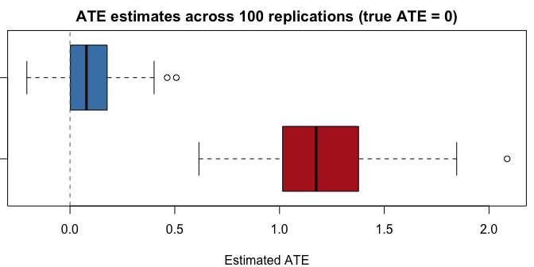

# forestBalance

**Forest Kernel Energy Balancing for Causal Inference**

`forestBalance` estimates average treatment effects (ATE) by combining
multivariate random forests with kernel energy balancing. A joint forest
model of covariates, treatment, and outcome defines a proximity kernel
that captures confounding structure. Balancing weights are then obtained
via a closed-form kernel energy distance solution.

The method is described in:

> De, B. and Huling, J. (2024). *Kernel Energy Balancing with Random
> Forest Similarity.* arXiv:2512.18069.

## Installation

``` r
# Install from GitHub
devtools::install_github("jaredhuling/forestBalance")
```

## Quick start

``` r
# library(forestBalance)

# Simulate observational data with nonlinear confounding (true ATE = 0)
set.seed(42)
dat <- simulate_data(n = 500, p = 10, ate = 0)

# Estimate ATE with forest kernel energy balancing
fit <- forest_balance(dat$X, dat$A, dat$Y)
fit
#> Forest Kernel Energy Balancing
#> -------------------------------------------------- 
#>   n = 500  (n_treated = 187, n_control = 313)
#>   Trees: 1000
#>   ATE estimate: -0.0720
#>   ESS: treated = 128/187 (69%)   control = 219/313 (70%)
#> -------------------------------------------------- 
#> Use summary() for covariate balance details.
```

## How it works

The method proceeds in three steps:

1.  **Joint forest model:** A `grf::multi_regression_forest` is fit on
    covariates $X$ with the bivariate response $(A, Y)$. Because the
    forest splits on both treatment and outcome, the resulting tree
    structure captures confounding relationships.

2.  **Proximity kernel:** The $n \times n$ kernel matrix $K(i,j)$ is
    defined as the proportion of trees where observations $i$ and $j$
    share a leaf node. This is computed efficiently via a single sparse
    matrix cross-product.

3.  **Kernel energy balancing:** Balancing weights are obtained in
    closed form by solving a linear system derived from the kernel
    energy distance objective. The weights make the treated and control
    distributions similar with respect to the forest-defined similarity
    measure.

## Detailed example

### Simulating data

`simulate_data()` generates observational data with nonlinear
confounding through a Beta density link:

``` r
set.seed(123)
dat <- simulate_data(n = 800, p = 10, ate = 0)

# Naive (unweighted) estimate is biased
naive_ate <- mean(dat$Y[dat$A == 1]) - mean(dat$Y[dat$A == 0])
cat("Naive ATE:", round(naive_ate, 4), " (true ATE = 0)\n")
#> Naive ATE: 0.9812  (true ATE = 0)
```

### Fitting the model

``` r
fit <- forest_balance(dat$X, dat$A, dat$Y, num.trees = 1000)
```

### Print and summary

`print()` gives a concise overview:

``` r
fit
#> Forest Kernel Energy Balancing
#> -------------------------------------------------- 
#>   n = 800  (n_treated = 275, n_control = 525)
#>   Trees: 1000
#>   ATE estimate: 0.0388
#>   ESS: treated = 191/275 (70%)   control = 394/525 (75%)
#> -------------------------------------------------- 
#> Use summary() for covariate balance details.
```

`summary()` provides a full covariate balance comparison (unweighted vs
weighted) with flagged imbalances:

``` r
summary(fit)
#> Forest Kernel Energy Balancing
#> ============================================================ 
#>   n = 800  (n_treated = 275, n_control = 525)
#>   Trees: 1000
#>   Kernel density: 29.0% nonzero
#> 
#>   ATE estimate: 0.0388
#> ============================================================ 
#> 
#> Covariate Balance (|SMD|)
#> ------------------------------------------------------------ 
#>   Covariate     Unweighted      Weighted
#>   ----------  ------------  ------------
#>   X1              0.1668 *        0.0220
#>   X2              0.2956 *        0.0086
#>   X3                0.0277        0.0148
#>   X4              0.1102 *        0.0242
#>   X5                0.0430        0.0210
#>   X6                0.0189        0.0055
#>   X7                0.0945        0.0258
#>   X8                0.0733        0.0033
#>   X9                0.0332        0.0284
#>   X10               0.0734        0.0055
#>   ----------  ------------  ------------
#>   Max |SMD|         0.2956        0.0284
#>   (* indicates |SMD| > 0.10)
#> 
#> Effective Sample Size
#> ------------------------------------------------------------ 
#>   Treated: 191 / 275  (70%)
#>   Control: 394 / 525  (75%)
#> 
#> Energy Distance
#> ------------------------------------------------------------ 
#>   Unweighted: 0.0486
#>   Weighted:   0.0144
#> ============================================================
```

### Balance on nonlinear transformations

Since confounding operates through nonlinear functions of $X_1$ and
$X_5$, we can check balance on transformations of the covariates:

``` r
X <- dat$X
X.nl <- cbind(
  X[,1]^2, X[,2]^2, X[,5]^2,
  X[,1] * X[,2], X[,1] * X[,5],
  dbeta(X[,1], 2, 4), dbeta(X[,5], 2, 4)
)
colnames(X.nl) <- c("X1^2", "X2^2", "X5^2", "X1*X2", "X1*X5",
                     "Beta(X1)", "Beta(X5)")

summary(fit, X.trans = X.nl)
#> Forest Kernel Energy Balancing
#> ============================================================ 
#>   n = 800  (n_treated = 275, n_control = 525)
#>   Trees: 1000
#>   Kernel density: 29.0% nonzero
#> 
#>   ATE estimate: 0.0388
#> ============================================================ 
#> 
#> Covariate Balance (|SMD|)
#> ------------------------------------------------------------ 
#>   Covariate     Unweighted      Weighted
#>   ----------  ------------  ------------
#>   X1              0.1668 *        0.0220
#>   X2              0.2956 *        0.0086
#>   X3                0.0277        0.0148
#>   X4              0.1102 *        0.0242
#>   X5                0.0430        0.0210
#>   X6                0.0189        0.0055
#>   X7                0.0945        0.0258
#>   X8                0.0733        0.0033
#>   X9                0.0332        0.0284
#>   X10               0.0734        0.0055
#>   ----------  ------------  ------------
#>   Max |SMD|         0.2956        0.0284
#>   (* indicates |SMD| > 0.10)
#> 
#> Transformed Covariate Balance (|SMD|)
#> ------------------------------------------------------------ 
#>   Transform     Unweighted      Weighted
#>   ----------  ------------  ------------
#>   X1^2            0.2904 *        0.0259
#>   X2^2              0.0941        0.0322
#>   X5^2              0.0841        0.0694
#>   X1*X2           0.1303 *        0.0144
#>   X1*X5             0.0573        0.0582
#>   Beta(X1)        0.6847 *        0.0347
#>   Beta(X5)          0.0289        0.0138
#>   ----------  ------------  ------------
#>   Max |SMD|         0.6847        0.0694
#> 
#> Effective Sample Size
#> ------------------------------------------------------------ 
#>   Treated: 191 / 275  (70%)
#>   Control: 394 / 525  (75%)
#> 
#> Energy Distance
#> ------------------------------------------------------------ 
#>   Unweighted: 0.0486
#>   Weighted:   0.0144
#> ============================================================
```

### Standalone balance diagnostics

`compute_balance()` can be used independently with any set of weights:

``` r
# Inverse propensity weights (using true propensity scores)
ipw <- ifelse(dat$A == 1, 1 / dat$propensity, 1 / (1 - dat$propensity))

bal_forest <- compute_balance(dat$X, dat$A, fit$weights)
bal_ipw    <- compute_balance(dat$X, dat$A, ipw)

cat("Forest balance max |SMD|:", round(bal_forest$max_smd, 4), "\n")
#> Forest balance max |SMD|: 0.0284
cat("IPW balance max |SMD|:   ", round(bal_ipw$max_smd, 4), "\n")
#> IPW balance max |SMD|:    0.2508
```

### Lower-level interface

For more control, the pipeline can be run step by step:

``` r
library(grf)

# 1. Fit the joint forest
forest <- multi_regression_forest(dat$X, scale(cbind(dat$A, dat$Y)),
                                  num.trees = 500)

# 2. Extract leaf node matrix and build kernel
leaf_mat <- get_leaf_node_matrix(forest, dat$X)
K <- leaf_node_kernel(leaf_mat)

cat("Leaf matrix:", nrow(leaf_mat), "obs x", ncol(leaf_mat), "trees\n")
#> Leaf matrix: 800 obs x 500 trees
cat("Kernel: ", round(100 * length(K@x) / prod(dim(K)), 1), "% nonzero\n")
#> Kernel:  24.5 % nonzero

# 3. Compute balancing weights
bal <- kernel_balance(dat$A, K)

ate <- weighted.mean(dat$Y[dat$A == 1], bal$weights[dat$A == 1]) -
       weighted.mean(dat$Y[dat$A == 0], bal$weights[dat$A == 0])
cat("ATE estimate:", round(ate, 4), "\n")
#> ATE estimate: 0.1455
```

## Simulation study

A small simulation comparing the forest balance estimator against the
naive (unadjusted) difference in means:

``` r
set.seed(1)
nreps <- 100
results <- matrix(NA, nreps, 2, dimnames = list(NULL, c("Naive", "Forest")))

for (r in seq_len(nreps)) {
  dat <- simulate_data(n = 500, p = 10, ate = 0)
  fit <- forest_balance(dat$X, dat$A, dat$Y, num.trees = 500)
  results[r, "Naive"]  <- mean(dat$Y[dat$A == 1]) - mean(dat$Y[dat$A == 0])
  results[r, "Forest"] <- fit$ate
}
```

    #>                Bias       SD     RMSE
    #> ------------------------------------
    #> Naive        1.2055   0.2983   1.2419
    #> Forest       0.0932   0.1428   0.1705

<!-- -->

## Key functions

| Function | Description |
|----|----|
| `forest_balance()` | High-level: fit forest, build kernel, compute weights, return ATE |
| `simulate_data()` | Simulate observational data with nonlinear confounding |
| `compute_balance()` | Covariate balance diagnostics (SMD, ESS, energy distance) |
| `get_leaf_node_matrix()` | Fast vectorized leaf node extraction from grf forests |
| `leaf_node_kernel()` | Sparse proximity kernel from leaf node matrix |
| `forest_kernel()` | Convenience: forest object to kernel in one call |
| `kernel_balance()` | Closed-form kernel energy balancing weights |
